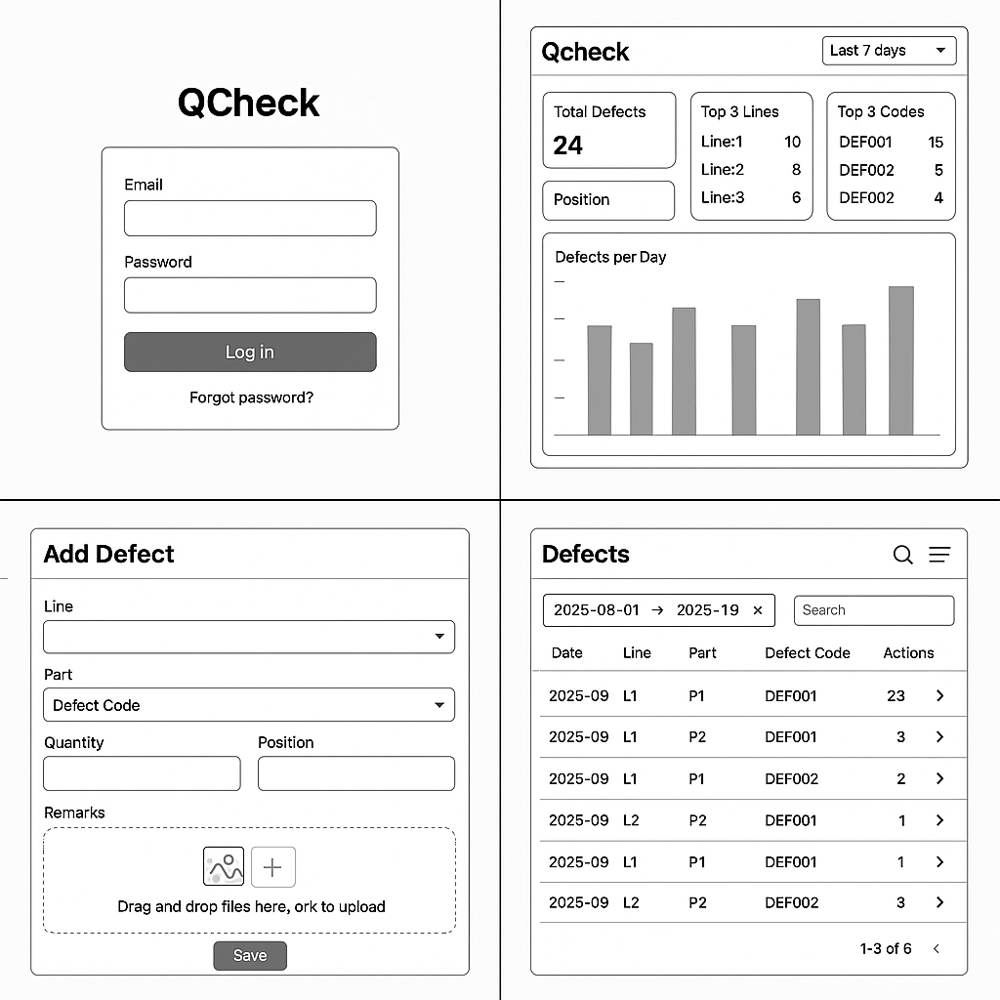

# Qcheck
품질 Saas 사이드 프로젝트 

# DB
postgresql 17.6 설치페이지
https://www.enterprisedb.com/downloads/postgres-postgresql-downloads

psql 환경변수 등록 필요
ex: C:\Program Files\PostgreSQL\17\bin 경로를 PATH 환경 변수에 추가

psql을 이용하여 DB 생성 필요

psql 접속 방법
psql -U "사용자"
CREATE DATABASE qcheck;

# 구조도

# 🔍 Claude 자동 코드리뷰 시스템

Claude를 활용한 프롬프트 기반 자동 코드리뷰 시스템으로, 개발자가 효율적으로 코드 품질을 향상시킬 수 있도록 도와줍니다.

code_review/README-code-review.md 파일 참고
인코딩 문제로 영어로 변경.
출력은 마지막에 한국어로 나옴

실행 시 QCHECK 디렉터리에서 code_review\code-review-all.bat -All 형식으로 사용해야함
